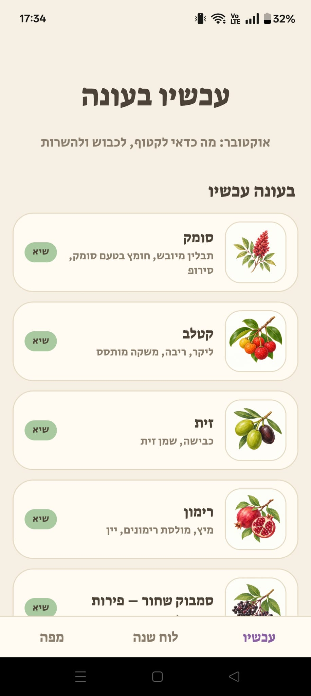
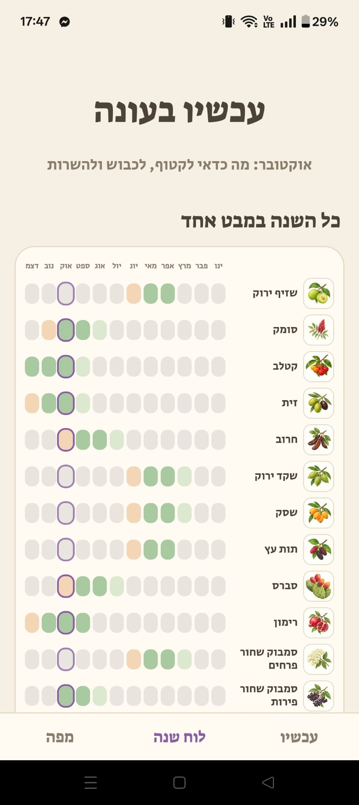
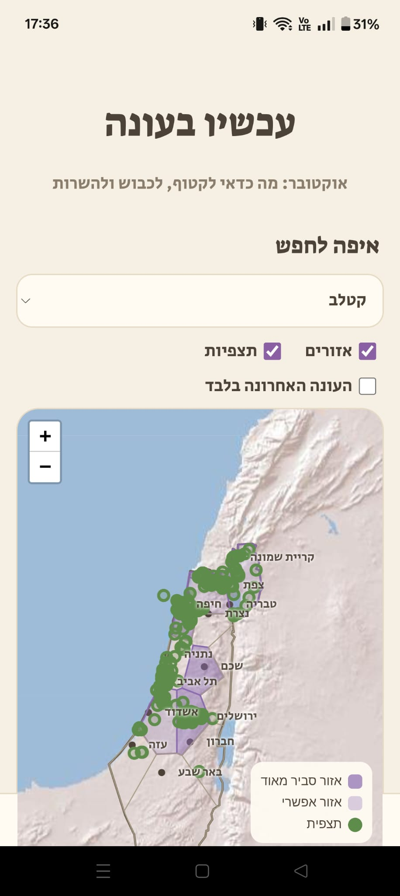

<div dir="rtl">

# עכשיו בעונה 🌿

[English](README.md) · **עברית**

אפליקציית ווב לנייד (PWA, עברית, מימין לשמאל) שמראה מה בעונה בישראל: פירות, פרחים וצמחי בר ותרבות ללקט, לכבוש, להתסיס ולהכין מהם ליקרים (סומק, שזיף ירוק, קטלב, זיתים, סמבוק, ועוד). האפליקציה אומרת מה בשל עכשיו, מה מתחיל בקרוב ואיפה בארץ הכי סביר למצוא אותו, ומוסיפה תזכורת ליומן כדי שתהיו מוכנים עם צנצנות ומלח בזמן.

> **האפליקציה באוויר:** `https://bnayahami.github.io/ripe-now/`
> **גרסה:** 1.0.2 · **רישיון:** MIT לקוד (ראו [רישיון](#רישיון))

<table align="center"><tr><td align="center"><br><sub>עכשיו</sub></td><td align="center"><br><sub>לוח שנה</sub></td><td align="center"><br><sub>מפה</sub></td></tr></table>

## מה יש באפליקציה

| לשונית / יכולת | מה היא עושה |
|---|---|
| **עכשיו** | כל 20 הגידולים בשלוש קבוצות: *בעונה עכשיו* (השיא קודם), *מתחילים בקרוב* (עד חודשיים) ו*בהמשך השנה*. |
| **לוח שנה** | פס של 12 חודשים לכל גידול (תחילה, שיא, סוף) עם האיור שלו. כפתור אחד מוריד את כל הלוח כתמונה. |
| **מפה** | מפת פאזל של ישראל, יהודה ושומרון, רצועת עזה והגולן. אזורים סגולים מסמנים איפה גידול *סביר מאוד* או *אפשרי*, ונקודות ירוקות הן תצפיות אמיתיות מ-iNaturalist (חמש שנים אחרונות, או העונה האחרונה בלבד). תוויות ערים בעברית ומפת תבליט. |
| **מסך גידול** | חודשי שיא, שימושים, רשימת הכנות, אזורים סבירים, הערה מעשית והסתייגויות חוקיות, רמת ביטחון, מקורות וסיכום תצפיות חי מ-iNaturalist. |
| **תזכורת שנתית** | מורידה אירוע יומן ‎.ics‎ (יום שלם, חוזר מדי שנה, 14 יום לפני תחילת העונה) עם רשימת ההכנות בהערות. |
| **קישורים** | חיפוש מתכונים בגוגל וחיפוש פוסטים בפייסבוק לכל גידול. *מגבלה ידועה: קישור החיפוש בפייסבוק לא עובד בטלפון. אפשר להשתמש בו מהמחשב, או לחפש בתוך אפליקציית פייסבוק.* |
| **PWA** | אפשר להתקין למסך הבית. הרשימה, לוח השנה ומסכי הגידולים עובדים גם בלי חיבור, והאפליקציה מתעדכנת לבד כשיש חיבור. |

## שימוש באפליקציה

פותחים את האפליקציה בדפדפן של הטלפון (בלי הורדה, בלי הרשמה, בחינם):

**https://bnayahami.github.io/ripe-now/**

לחוויה הטובה ביותר מומלץ להתקין אותה בטלפון כמתואר בהמשך.

## התקנה בטלפון

אפשר להשתמש באפליקציה בדפדפן, אבל התקנה מוסיפה את סמל העלה למסך הבית, פותחת אותה במסך מלא כמו אפליקציה רגילה, ומאפשרת לה לעבוד גם בלי חיבור.

**אנדרואיד (Chrome)**
1. פותחים את הקישור למעלה ב-Chrome וממתינים כמה שניות לטעינת הדף.
2. לוחצים על תפריט **⋮**, ואז על **התקנת אפליקציה** (או **הוספה למסך הבית**) ומאשרים.
3. פותחים מהסמל החדש במסך הבית.

**אייפון (Safari בלבד)**
1. פותחים את הקישור למעלה ב-**Safari**. דפדפנים אחרים באייפון לא יכולים להתקין.
2. לוחצים על כפתור **שיתוף** (ריבוע עם חץ), גוללים למטה ולוחצים על **הוסף למסך הבית**, ואז על **הוסף**.
3. פותחים מהסמל החדש במסך הבית.

**מחשב (Chrome או Edge):** לוחצים על סמל ההתקנה בקצה שורת הכתובת.

**שימוש בלי חיבור:** אחרי ביקור ראשון עם חיבור לאינטרנט, רשימת הגידולים, לוח השנה ומסכי הגידולים עובדים גם בלי חיבור. המפה מציגה את האזורים שצפיתם בהם קודם. נקודות התצפיות ויצירת קו המתאר בפעם הראשונה דורשות חיבור.

**עדכונים** מגיעים לבד: פותחים את האפליקציה כשיש חיבור, וסוגרים ופותחים אותה פעם אחת כדי לקבל את הגרסה החדשה.

## מבנה הפרויקט

```
index.html              ממשק, עיצוב ולוגיקה (קובץ יחיד)
data.js                 נתוני הגידולים (עונות, אזורים, מקורות, הערות)
sw.js                   שירות עבודה (מטמון לפעולה בלי חיבור)
manifest.webmanifest    מניפסט PWA
icons/                  סמלי האפליקציה
images/                 איורי הגידולים (20 קבצי PNG)
docs/                   תיעוד מפורט (באנגלית, ראו להלן)
```

## תיעוד

| מסמך | תוכן |
|---|---|
| [docs/ARCHITECTURE.md](docs/ARCHITECTURE.md) | איך האפליקציה עובדת: מודל העונות, בניית המפה, שאילתות iNaturalist, תזכורות, PWA ועיצוב. |
| [docs/DATA-SCHEMA.md](docs/DATA-SCHEMA.md) | מבנה ‎data.js‎, מפתחות האזורים, ואיך מוסיפים או עורכים גידול. |
| [docs/DATA-SOURCES.md](docs/DATA-SOURCES.md) | טבלה לכל גידול, איך נבחרו הערכים, רמות ביטחון ונקודות חלשות. |
| [docs/DEPLOY.md](docs/DEPLOY.md) | פרסום ב-GitHub Pages, שחרור עדכונים, בדיקות PWA ופתרון תקלות. |
| [CONTRIBUTING.md](CONTRIBUTING.md) | איך מדווחים על טעויות בנתונים ואיך תורמים. |
| [CHANGELOG.md](CHANGELOG.md) | היסטוריית גרסאות. |

## על הנתונים (חשוב לקרוא)

העונות והאזורים **נאספו ממקורות פומביים** (מאגר צמח השדה של קק״ל, Flora of Israel Online, ויקיפדיה העברית, מועצת הצמחים, ארגון מגדלי הפירות, אתרי ליקוט וגינון) ו**לא אומתו בשטח**. כל גידול מציג רמת ביטחון ומקורות. הערכים החלשים ביותר: שיזף, צנוברים, פסיפלורה ופירות סמבוק. פירוט ב-[docs/DATA-SOURCES.md](docs/DATA-SOURCES.md).

**בטיחות וחוק.** כמה מהצמחים מוגנים בטבע בישראל (למשל הדס, שקד בר, עצי קטלב וחרוב בבתי גידול טבעיים). כבדו שמורות טבע ושטחים פרטיים, ובקשו רשות. לעולם אל תאכלו צמח שאינכם מזהים בוודאות. את פירות הסמבוק חייבים לבשל, ומוהל התאנה מגרה את העור. האפליקציה היא כלי מידע, לא מדריך שטח ולא ייעוץ מקצועי.

## קרדיטים ורישיונות נתונים

- **אריחי מפה:** Esri World Shaded Relief ‏(© Esri ותורמים). כדאי לבדוק את [תנאי Esri](https://www.esri.com/en-us/legal/terms/full-master-agreement) לפי היקף התנועה הצפוי, או להחליף שכבת אריחים ב-‎index.html‎.
- **קו מתאר:** © תורמי [OpenStreetMap](https://www.openstreetmap.org/copyright) ‏(ODbL), נטען בזמן ריצה מ-Nominatim ונשמר בדפדפן המבקר, ומשולב עם נתוני יבשה של [Natural Earth](https://www.naturalearthdata.com/) (נחלת הכלל) דרך ‎world-atlas‎.
- **תצפיות:** תצפיות הקהילה של [iNaturalist](https://www.inaturalist.org/) דרך ה-API הציבורי. הצלמים שומרים על זכויות בתמונות שלהם. האפליקציה מציגה רק ספירות ומיקומים.
- **ספריות (CDN):** ‏Leaflet 1.9.4, ‏Turf.js 6.5.0, ‏topojson-client 3.1.0.
- **גופנים:** Suez One ו-Secular One ‏(Google Fonts, ‏SIL OFL).
- **איורים:** יצירה מקורית בסגנון צבעי מים של יוצר הפרויקט (ראו רישיון).

## רישיון

- **הקוד** (‎index.html‎, ‎sw.js‎, מבנה ‎data.js‎, תיעוד): ‏[MIT](LICENSE).
- **האיורים** (‎images/‎) ו**ערכי הנתונים שנאספו**: © יוצר הפרויקט. אנא בקשו רשות לפני שימוש חוזר באיורים.

נבנה בעזרת עוזר בינה מלאכותית (Claude של Anthropic) לקוד ולמחקר, ונבדק על ידי היוצר.

</div>
